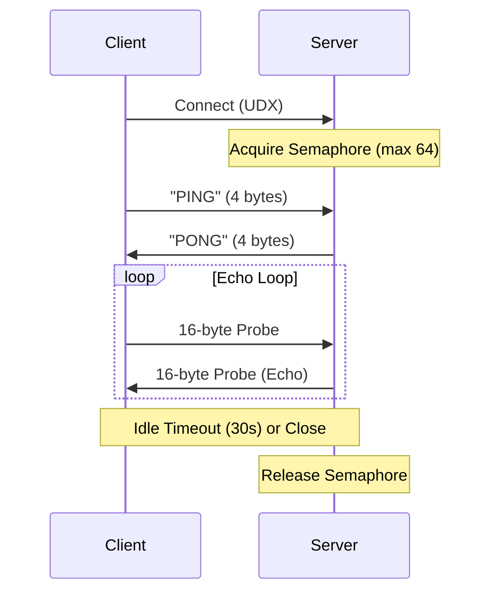

# Echo Protocol

The Echo Protocol is a simple diagnostic service enabled by the `--ping` flag in the `announce` command. It allows remote peers to measure latency and verify end-to-end connectivity over the peeroxide swarm.

## Protocol Constants

- **PING_MAGIC**: `0x50 0x49 0x4E 0x47` (`b"PING"`)
- **PONG_MAGIC**: `0x50 0x4F 0x4E 0x47` (`b"PONG"`)
- **MAX_ECHO_SESSIONS**: 64 (concurrency limit)
- **HANDSHAKE_TIMEOUT**: 5 seconds
- **IDLE_TIMEOUT**: 30 seconds
- **ECHO_MSG_LEN**: 16 bytes

## Echo Probe Frame

Each probe message is exactly 16 bytes long and follows this layout:

| Offset | Size | Field | Description |
|--------|------|-------|-------------|
| 0 | 8 | seq | u64, little-endian sequence number |
| 8 | 8 | timestamp_nanos | u64, little-endian Unix timestamp in nanoseconds |

## Session Lifecycle

1. **Accept**: The server accepts an incoming UDX connection.
2. **Semaphore Acquisition**: The server attempts to acquire a permit from a 64-slot semaphore. If all slots are full, the connection is dropped.
3. **Handshake**:
    - The server waits up to 5 seconds for the client to send the `PING_MAGIC` (4 bytes).
    - If the magic matches, the server replies with `PONG_MAGIC` (4 bytes).
4. **Echo Loop**:
    - The server enters a loop, waiting for messages from the client with a 30-second idle timeout.
    - Each message must be exactly 16 bytes (`ECHO_MSG_LEN`).
    - The server echoes the exact 16-byte message back to the client.
5. **Disconnect**: The session ends if the timeout is reached, a message of incorrect length is received, or the stream is closed.
6. **Release**: The semaphore permit is released, allowing a new session to begin.

## Sequence Diagram

## Logging

The `announce` command logs session events to stderr:

- `  [connected] @<pk> (echo mode)`
- `  [disconnected] @<pk> (<N> probes echoed)`
