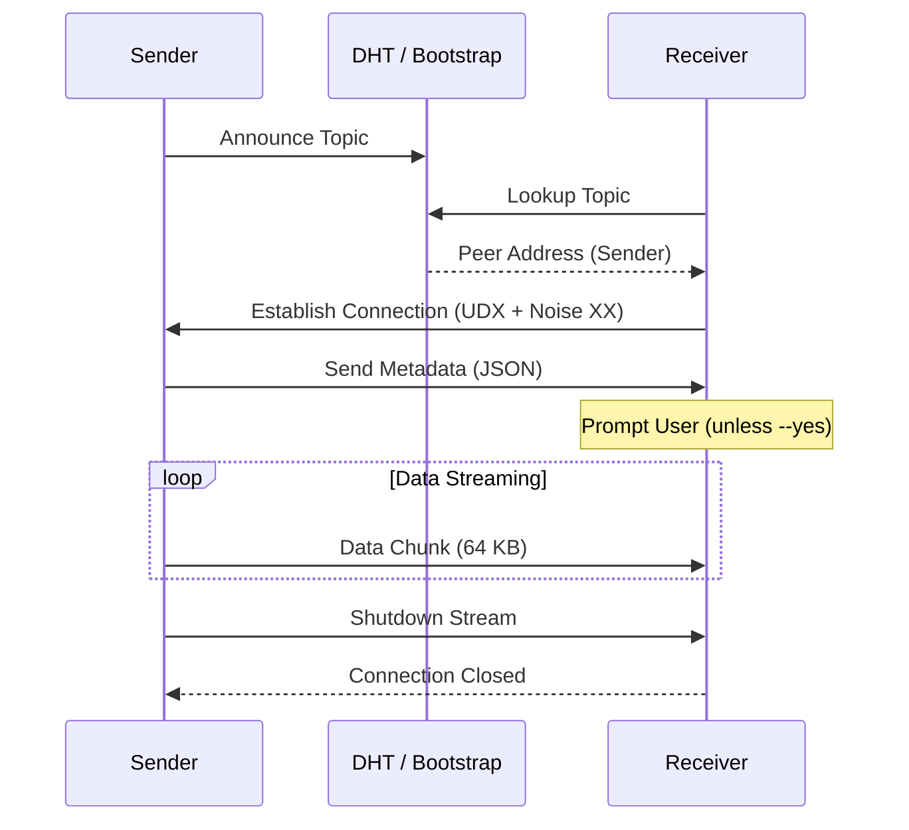

# cp — Protocol

The `cp` tool is built on top of the `peeroxide` swarm, leveraging the DHT for peer discovery and UDX for efficient data transport.

## Data Flow

The transfer process involves two main stages: discovery and streaming.

### 1. Discovery

- **Sender**: Joins the topic on the DHT as a server (`JoinOpts { client: false, .. }`). It announces its presence and waits for incoming connections.
- **Receiver**: Joins the topic on the DHT as a client (`JoinOpts { server: false, .. }`). It looks for peers announcing the topic and attempts to connect to them.

### 2. Protocol Handshake

Once a connection is established, the peers perform a simple JSON-based handshake:

1. **Metadata**: The sender transmits a JSON object containing file information:
   - `filename`: The name of the file being sent.
   - `size`: The total size in bytes (if known; `null` when streaming from stdin).
   - `version`: The protocol version (currently `1`).
2. **Acceptance**: The receiver validates the metadata and (unless `--yes` is used) prompts the user for confirmation.

### 3. Streaming

Data is streamed in chunks (`CHUNK_SIZE = 65536` bytes) over the established SecretStream.

## Implementation Details

### Chunking

While the underlying UDX protocol handles packetization, `cp` reads and writes data in 64 KB blocks. This balances memory usage with throughput efficiency.

### File Handling

- **Temporary Files**: During a receive operation, data is written to a hidden temporary file in the destination directory.
- **Atomic Rename**: Once the transfer is complete and the received size matches the expected size, the temporary file is renamed to the final destination. This prevents partial or corrupted files if a transfer is interrupted.
- **Sanitization**: Filenames provided by the sender are sanitized to prevent path traversal attacks (e.g., stripping `..` components and leading slashes).

### Network Configuration

The `cp` command respects global peeroxide configuration for bootstrap nodes and firewall settings. If `--public` is set, the swarm uses public bootstrap nodes with an open firewall. Otherwise, hole-punching is attempted for NAT traversal.
