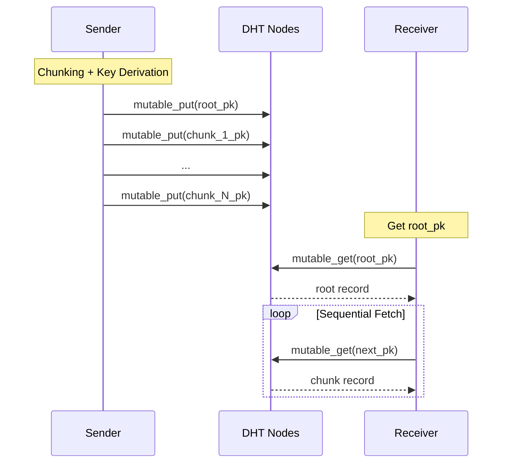
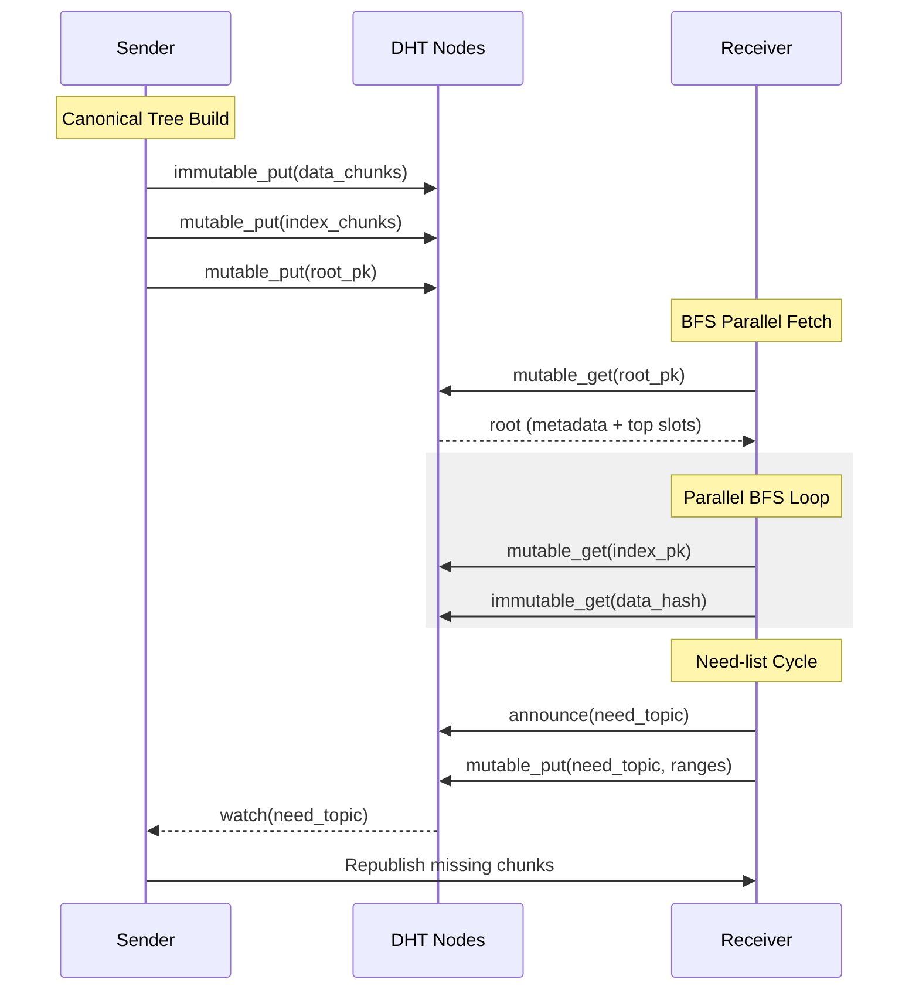

# Dead Drop Architecture

The `dd` command implements two distinct protocol architectures for storing and retrieving data on the DHT. Both protocols are built on the DHT primitives documented in [DHT Primitives](../concepts/dht-primitives.md) (`mutable_put` / `mutable_get` / `immutable_put` / `immutable_get` / `announce`).

## Protocol V1: Linear Chain

The V1 protocol is a simple linked list of mutable DHT records. Each record contains a portion of the file and the public key of the next chunk in the chain.

### V1 Flow

V1 features sequential fetching with exponential retry logic (1s to 30s) per chunk, bounded by the global timeout.

## Protocol V2: Merkle Tree

V2 uses a hierarchical tree structure to enable massive file support and parallel fetching.

### V2 Flow

### AIMD Congestion Control

V2 employs an Additive Increase / Multiplicative Decrease (AIMD) controller to manage concurrency:
- **EWMA-based:** Smoothes sample noise with an alpha of 0.1.
- **Decision interval:** 20 samples.
- **Fast-trip:** Shrinks immediately if 10 degraded samples occur within a window.
- **Shrink:** 0.75x current (minimum 1).
- **Grow:** +2 permits.

### Robustness Mechanisms

- **Stall Watchdog:** Checks every 5s. If no put resolves for 30s, it forces AIMD to a recovery floor.
- **Sliding-window Timeout:** `get` operations abort only if no chunk decodes for `--timeout` seconds.
- **Graceful Shutdown:** First Ctrl-C triggers a sticky cancel signal that enqueues cleanups (like empty need-list sentinels). A second double-press force-exits.
- **Need-list Lifecycle:** Receivers publish the encoded missing-range need-list via `mutable_put` every 20s and announce keepalive on the need topic every 60s. Senders poll the need topic every 5s and prioritize enqueuing the full path (index + data) for any newly-listed chunks.

## DHT Wire Monitoring

The `dd` command monitors raw network overhead by reading atomic counters from the underlying DHT handle.

| Method | Return |
|--------|--------|
| `wire_stats()` | `(u64, u64)` (sent, received) |
| `wire_counters()` | `WireCounters` (shared atomic handles) |

These counters allow the progress UI to calculate "wire amplification" — the ratio of total bytes sent/received versus actual payload bytes delivered.
