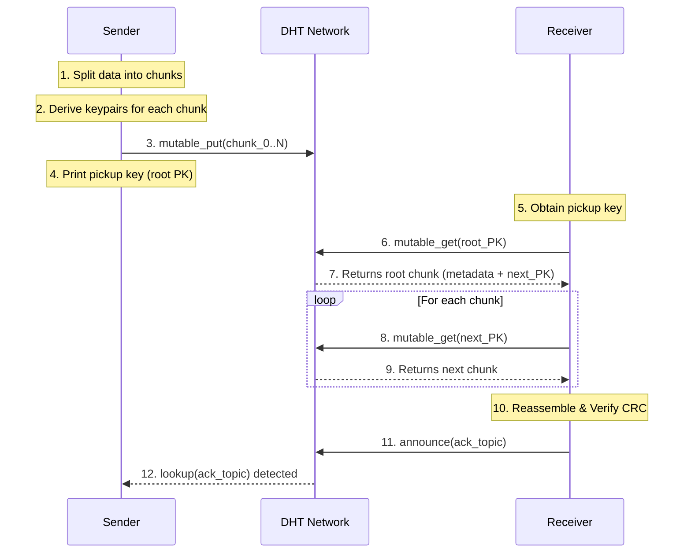

# Dead Drop Architecture

The dead drop protocol enables store-and-forward data delivery using the HyperDHT's mutable storage capabilities. It builds a linked chain of signed chunks, where each chunk is stored on the DHT at a location derived from a deterministic key derivation scheme.

## Data Flow

The following diagram illustrates the interaction between the Sender, the DHT network, and the Receiver.

## Key Components

### Mutable DHT Storage
Unlike immutable storage (used in `cp`), dead drop uses `mutable_put` and `mutable_get`. This allows the sender to refresh records to extend their lifespan on the DHT (which typically expires after 20 minutes). Records are signed by the sender, ensuring that DHT nodes or malicious actors cannot modify the data without invalidating the signature.

### Chunking and Chaining
Data is split into chunks to fit within the DHT's payload limits (max 1000 bytes per chunk).
- **Root Chunk:** Contains the total chunk count, a CRC-32C checksum of the full payload, and the public key of the next chunk.
- **Continuation Chunks:** Contain the payload and the public key of the next chunk in the sequence.
- **Termination:** The final chunk in the chain has its `next_pk` field set to 32 zero bytes.

### Key Derivation
All keypairs for the chunks are derived deterministically from a single `root_seed`.
- `root_seed`: 32 bytes (randomly generated or derived from a passphrase).
- `root_kp`: `KeyPair::from_seed(root_seed)`.
- `chunk_kp[i]`: Derived from `blake2b(root_seed || i_as_u16_le)`.

The **pickup key** is the public key of the root chunk. Since the receiver only has the public key, they can read the data but cannot derive the private keys required to modify or forge chunks.

### Acknowledgement (Ack) Mechanism
When a receiver successfully gets a dead drop, they "announce" their presence on a specific `ack_topic`.
- `ack_topic = discovery_key(root_public_key || b"ack")`
- The sender polls this topic using `lookup`.
- To maintain anonymity, the receiver uses an ephemeral keypair for the announcement.

