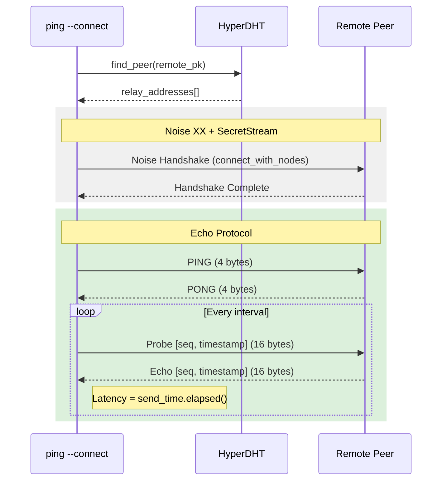

# Ping Architecture

The `ping` tool operates at two distinct layers of the Peeroxide stack: the DHT RPC layer (UDP) and the Secure Stream layer (encrypted TCP-like transport).

## Control Flow

The primary logic resides in `peeroxide-cli/src/cmd/ping.rs`. Depending on the target type, it orchestrates a resolution phase followed by a probing phase.

### Targeted Probing with `--connect`

When using `@pubkey` or `<topic>` with the `--connect` flag, the tool follows this sequence:

1. **Resolution**: Queries the DHT (`find_peer` or `lookup`) to discover relay addresses for the target peer(s).
2. **Handshake**: Initiates a Noise XX handshake via the discovered relay addresses.
3. **SecretStream**: Establishes a multiplexed, encrypted stream.
4. **Echo Protocol**: Once the stream is ready, it initiates the [Echo Protocol](../announce/echo-protocol.md).

## NAT Classification Logic

During a bootstrap check (no target), the tool collects reflexive addresses (`Ipv4Peer`) returned by multiple bootstrap nodes in their response `to` field.

The classification is performed by the `NatType` enum:

- **Open**: The reflexive IP is a local interface address (verified by attempting to `bind` the IP) AND the reflexive port matches the local bound port.
- **Consistent**: All reflexive samples report the same `host:port`, but the IP is external. This indicates a hole-punchable NAT.
- **Random**: The reflexive host is the same across samples, but the ports vary. This typically requires relaying.
- **MultiHomed**: Different bootstrap nodes report different reflexive hosts.
- **Unknown**: No reflexive address samples were collected.

## DHT Interaction

- **Bootstrap mode**: Uses `dht.ping(host, port)` which translates to a `CMD_FIND_NODE` request on the wire. This is used because bootstrap nodes are expected to return closer nodes to help populate the routing table.
- **Direct/Targeted mode**: Uses the same `dht.ping` mechanism but focuses on the RTT and reachability of the specific target.

